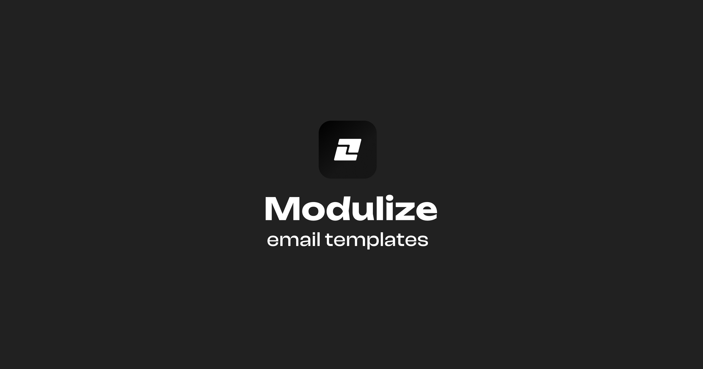

# @modulize/email

Copy and paste email templates built with React Email for your next project.



## Documentation

Visit http://email.modulize.co/docs to view the documentation.

## Setup

To develop emails, run the following command:

```bash
pnpm dev:email
```

To work on other parts of the project, run the following command:

```bash
pnpm dev
```

This will run everything except the email server.

## Troubleshooting

If Husky is complaining about not being able to execute. Run the following command:

```bash
chmod ug+x .husky/*
chmod ug+x .git/hooks/*
```

## License

Licensed under the [MIT license](LICENSE.md).